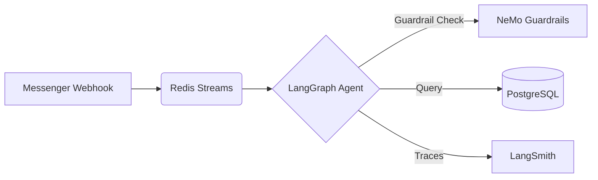

# Messenger AI Agent — Production Customer Support Bot

An e-commerce customer support agent for an Algerian clothing store, deployed on **Chatwoot** with Facebook Messenger integration. The bot handles product inquiries, policy questions (returns, delivery, warranty), media messages (photos, voice notes), and human handoff — all in Algerian darija, French, or English.

## Quick Start

```bash
# 1. Dependencies
python3 -m venv .venv && source .venv/bin/activate
pip install -r requirements.txt

# 2. Config
cp .env.example .env          # fill your keys

# 3. Run
uvicorn app.main:app --reload --port 8000

# 4. Verify
pytest                        # all tests should be green
```

Expose locally for webhook testing: `ngrok http 8000` → paste URL in Chatwoot webhook settings.

## Architecture

```
  Chatwoot / Meta Webhook ──► Redis Streams Queue ──► LangGraph Agent ──► Chatwoot API / Send API
                                     │                        │
                          dedupe + debounce + locks     PostgreSQL + NeMo Guardrails
                          XAUTOCLAIM recovery           Pinecone RAG (optional)
```


### Ingestion Layer
- **Chatwoot Webhook** (`app/chatwoot.py`) — Receives inbound messages. Validates a URL-path secret, parses tolerantly, and enqueues into Redis Streams.
- **Meta Webhook** (`app/webhook.py`) — GET verification + POST event receiver. HMAC-SHA256 signature check, envelope parsing, echo filtering.
- **Redis Streams Queue** (`app/cache/streams.py`) — Durable inbox. Consumer groups provide at-least-once delivery with `XAUTOCLAIM` reclamation of orphaned entries. Two idempotency flags prevent double-enqueue and double-reply. Poison entries are dead-lettered after N failed attempts.

### Processing Pipeline
1. **Dedupe** — Skip if already processed.
2. **Handoff Check** — Skip if a human has taken over.
3. **Media Transcription** — Photos described, voice notes transcribed via Gemini multimodal.
4. **Debounce** — Merge rapid messages into one turn.
5. **Lock** — Per-user distributed lock prevents concurrent turns.
6. **Agent Turn** — LangGraph multi-step tool-calling loop with Gemini.
7. **Send Reply** — Chunk long responses (>2000 chars) across multiple API calls.
8. **Log** — Append to PostgreSQL audit trail.

### Agent Layer
- **LangGraph State Machine** (`app/agent/graph.py`) — `START → input_guardrail → agent → (tools | output_guardrail) → END`. Input/output guardrails run via NeMo Guardrails. Memory checkpointed in PostgreSQL via `AsyncPostgresSaver`.
- **Tools** (`app/agent/tools.py`):
  - `search_products`: Exact SQL catalog lookup (never embeddings for prices). ILIKE search across name + description, sorted by relevance (in-stock first, then cheapest).
  - `policy_search`: PostgreSQL full-text search over published policies.
  - `handoff_to_human`: Assigns conversation to a human in Chatwoot or sets a local handoff flag.
- **Arabizi Normalizer** (`app/nlp/arabizi.py`) — Rule-based darija-to-Arabic-script mapping using a whole-word lexicon. Numbers survive untouched by construction.

### Security & Safety
- **Webhook Signatures** — HMAC-SHA256 (Meta) and constant-time URL-path secret (Chatwoot).
- **PII Masking** — Credit card numbers masked in input/output via LangChain middleware with regex fallback.
- **NeMo Guardrails** — YAML-configurable input/output safety rails.
- **KB Admin Panel** — Token-authenticated CRUD for products and policies, served as a Chatwoot dashboard iframe.

## Configuration

All settings from `.env`:

| Variable | Default | Purpose |
|----------|---------|---------|
| `FACEBOOK_VERIFY_TOKEN` | — | Meta webhook verification |
| `FACEBOOK_APP_SECRET` | — | HMAC signature verification |
| `PAGE_ACCESS_TOKEN` | — | Meta Graph API auth |
| `GOOGLE_API_KEY` | — | Gemini LLM access |
| `DATABASE_URL` | — | PostgreSQL connection string |
| `REDIS_URL` | `redis://localhost:6379/0` | Redis connection |
| `CHATWOOT_BASE_URL` | — | Chatwoot instance URL |
| `CHATWOOT_API_TOKEN` | — | Chatwoot API auth |
| `CHATWOOT_WEBHOOK_SECRET` | — | Chatwoot webhook path secret |
| `CHATWOOT_ACCOUNT_ID` | 0 | Default Chatwoot account tenant |
| `CHATWOOT_HANDOFF_TEAM_ID` | 0 | Team ID for human escalation |
| `CHATWOOT_HANDOFF_AGENT_ID` | 0 | Agent ID for human escalation |
| `PINECONE_API_KEY` | — | Vector store API key |
| `DEBOUNCE_SECONDS` | 10 | Message burst merge window |
| `HISTORY_MAX_MESSAGES` | 30 | Conversation history cap |
| `QUEUE_ENABLED` | true | Enable Redis Streams queue |
| `QUEUE_RECLAIM_MIN_IDLE_S` | 180 | Seconds before reclaiming orphaned entries |
| `QUEUE_MAX_ATTEMPTS` | 3 | Failed attempts before dead-lettering |
| `QUEUE_MAXLEN` | 10000 | Stream length bound |
| `KB_ADMIN_TOKEN` | — | KB admin panel auth |
| `CORS_ORIGINS` | localhost:3000,... | Allowed CORS origins |
| `DB_AUTO_CREATE_TABLES` | true | Auto-create tables on startup |

## Testing

```bash
pytest                              # all unit tests
pytest tests/test_streams.py        # Redis Streams queue layer
pytest tests/test_agent.py          # agent graph + tool calling
pytest tests/test_chatwoot.py       # Chatwoot adapter + handoff
pytest tests/test_security.py       # Signature verification
pytest tests/test_repo.py           # Database repository
pytest tests/test_media.py          # Voice/image transcription
pytest tests/test_arabizi.py        # Darija normalization
pytest tests/test_retry.py          # Retry classification
pytest tests/test_kb.py             # KB admin API
```

## Directory Structure

```
messenger-agent/
├── app/
│   ├── main.py                  # FastAPI entrypoint, lifespan, resource wiring
│   ├── config.py                # All settings from .env
│   ├── security.py              # HMAC-SHA256 signature verification
│   ├── schemas.py               # Tolerant Pydantic models for webhook payloads
│   ├── webhook.py               # Meta webhook (GET verify + POST events)
│   ├── chatwoot.py              # Chatwoot webhook, outbound replies, handoff
│   ├── worker.py                # Core pipeline + queue consumer
│   ├── messenger_api.py         # Outbound Meta Graph API helper
│   ├── media.py                 # Voice transcription + image description
│   ├── kb.py                    # KB admin API + Chatwoot dashboard panel
│   ├── cache/
│   │   ├── redis_ops.py         # Dedupe, debounce, per-user locks
│   │   └── streams.py           # Redis Streams queue (producer + consumer ops)
│   ├── db/
│   │   ├── engine.py            # Async SQLAlchemy engine
│   │   ├── models.py            # ORM models (MessageLog, Customer, Product, Policy)
│   │   └── repo.py              # Database queries
│   ├── nlp/
│   │   └── arabizi.py           # Darija/Latin normalizer
│   └── agent/
│       ├── guardrails/
│          # NeMo Guardrails
│       ├── graph.py             # LangGraph state machine + guardrails nodes
│       ├── prompts.py           # System prompt (English + Darija versions)
│       ├── state.py             # AgentState TypedDict
│       ├── security.py          # Security checks
│       ├── tools.py             # Tool factory (search, policy, handoff)
│       └── security.py          # PII masking + NeMo Guardrails wrapper
├── rag/
│   ├── politiques_boutique.md   # Raw policy document
│   └── rag.py                   # Embedding + Pinecone ingestion script
├── tests/                       # All test suites
│   ├── evals/                   # LangSmith-compatible evaluation scripts
│   └── ...
├── docker-compose.yml           # Postgres + Redis dev stack
├── requirements.txt             # Dependencies
└── pyproject.toml               # ruff, mypy, pytest config
```

## Health Check

```bash
curl http://localhost:8000/health
```

Returns component status (db, redis, llm, guardrails, queue backlog) and overall health. Returns HTTP 503 when degraded.

## Key Design Decisions

- **Prices come from SQL, never from the LLM.** The agent is forbidden from stating numbers unless they appear in a `search_products` tool result. One invented number = a customer dispute.
- **Webhook ACK fast, work later.** Awaiting the LLM call inside the webhook handler causes the source to retry, and the customer gets answered twice. Always enqueue or spawn a background task.
- **At-least-once delivery requires two idempotency checks:** `seen:{...}` (producer, blocks duplicate enqueue) and `sent:{...}` (consumer, blocks double-reply on redelivery).
- **Eval-driven development.** A suite of deterministic evaluators (fact present, price refusal, tool used, brevity, handoff triggered) catches regressions before they reach customers. LLM-as-judge is reserved for tone only.
- **NeMo Guardrails won over alternatives because it's YAML-configurable.** New input/output rules don't require code changes.